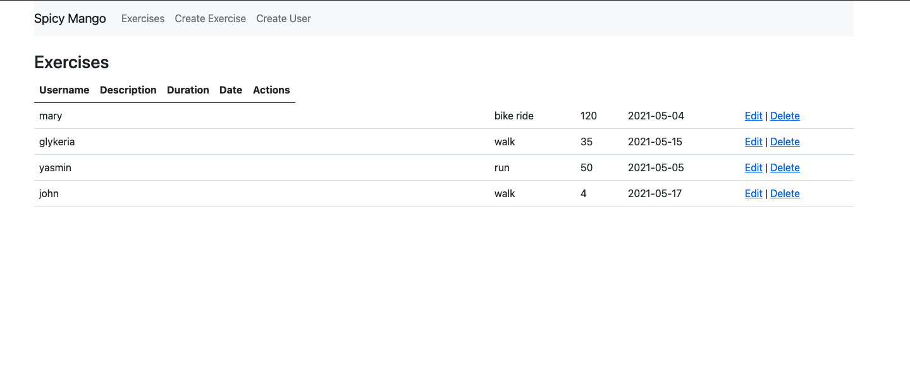
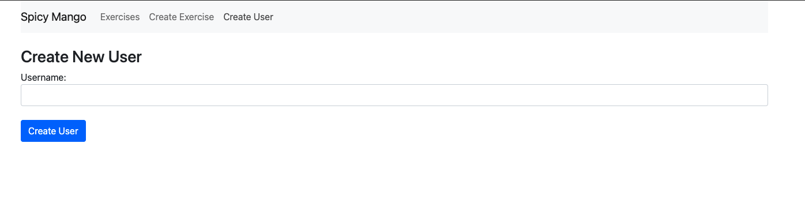
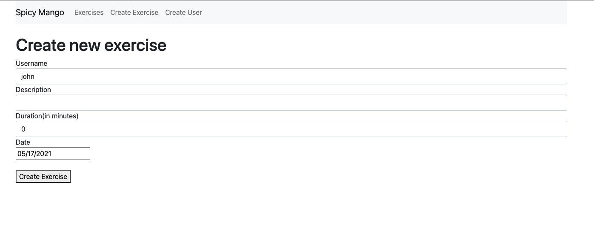

# Tech Test

## About

This project was made as a tech test and was bootstrapped with [Create React App](https://github.com/facebook/create-react-app).
I created a web app where the users can log their exercises.

## Technologies used

Used the MERN stack.

| Area      | Technology            |
| --------- | --------------------- |
| Framework | React Native, Express |
| Language  | Javascript            |
| Database  | MongoDB               |

## How to run

1. Clone this repository by entering 'git clone https://github.com/GlykeriaStr/Tech_Test.git' in your terminal
2. Navigate to the root directory of the project
3. Enter 'npm install' in your terminal to install dependencies
4. Enter 'npm start' in your terminal and the page will load in your browser.

## Screenshots of the app

List of Exercises

Create User

Create Exercise

